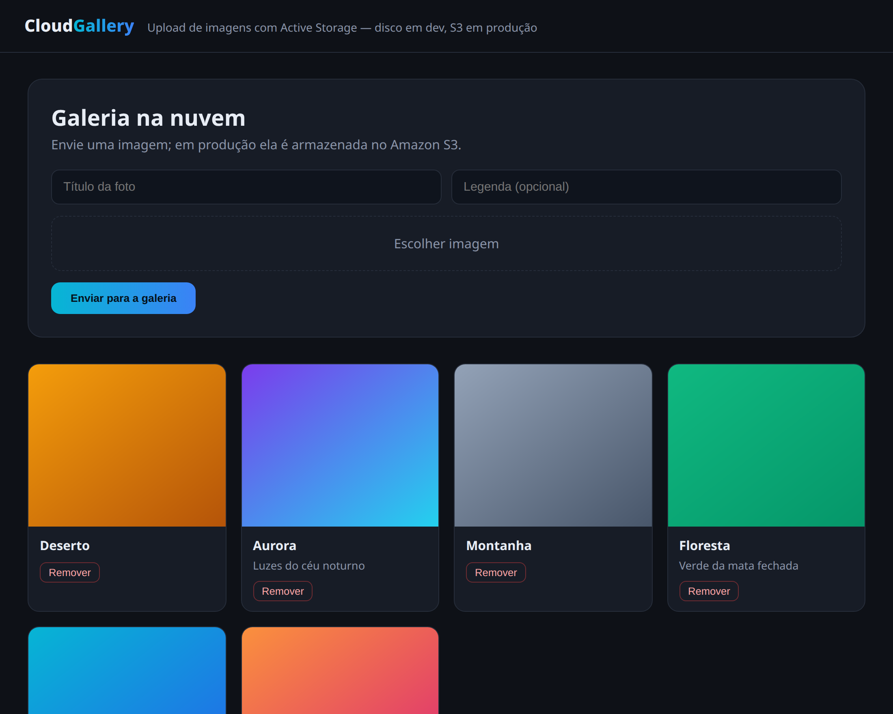

<div align="center">
  <h1>CloudGallery</h1>
  <p><strong>Galeria de fotos com upload na nuvem — Ruby on Rails 8 + Active Storage + Amazon S3.</strong></p>
</div>

<div align="center">
  
</div>

---

## Visão geral

Uma galeria onde se envia imagens com título e legenda. O foco é a **manipulação de
arquivos** e a **integração com armazenamento em nuvem**: o **Active Storage** abstrai
onde os arquivos ficam, e a aplicação usa **disco em desenvolvimento** e **Amazon S3 em
produção** — trocando o backend por configuração, sem mudar o código.

## Como o armazenamento é resolvido

```
              Active Storage
  Upload  ──►  has_one_attached :image  ──►  service configurável
                                               │
              dev/test  ──►  Disk (storage/)   │
              produção  ──►  Amazon S3 (bucket) ◄── credenciais via ENV
```

- O modelo `Photo` ([app/models/photo.rb](app/models/photo.rb)) usa
  `has_one_attached :image` e valida presença e tipo do arquivo.
- O serviço é escolhido por ambiente: produção usa `:amazon` **se** um bucket estiver
  configurado, senão cai para disco (ver `config/environments/production.rb`).
- As credenciais da AWS vêm de **variáveis de ambiente** — nada de segredo no repositório.
- Uploads usam **Direct Upload** do Active Storage (`direct_upload: true`), que envia o
  arquivo direto ao storage, aliviando o servidor.

## Configuração do S3 (produção)

```bash
export AWS_ACCESS_KEY_ID="..."
export AWS_SECRET_ACCESS_KEY="..."
export AWS_REGION="us-east-1"
export S3_BUCKET="meu-bucket-de-fotos"
```

Com `S3_BUCKET` definido, a aplicação passa a guardar os uploads no S3 automaticamente.

## Funcionalidades

- Upload de imagens (PNG, JPG, WEBP, GIF) com validação de tipo
- Galeria em grade com título e legenda
- Remoção de fotos
- Direct Upload para o storage
- Backend de armazenamento configurável (disco / S3) por ambiente

## Como rodar

```bash
git clone https://github.com/Dudainfinity/gallery-s3.git
cd gallery-s3
bundle install
bin/rails db:prepare db:seed   # popula com algumas imagens de exemplo
bin/rails server
```

Acesse `http://localhost:3000` e envie suas imagens. Em dev, ficam em `storage/`.

## Testes

```bash
bin/rails test
```

Cobrem as validações do modelo (título e tipo de imagem obrigatórios) e o fluxo de
upload de ponta a ponta (envio cria o `Photo` com o anexo; envio sem imagem é rejeitado).

## Stack

| Camada        | Tecnologia                          |
|---------------|-------------------------------------|
| Framework     | Ruby on Rails 8.1                   |
| Arquivos      | Active Storage                      |
| Nuvem         | Amazon S3 (`aws-sdk-s3`)            |
| Banco         | SQLite                              |
| Testes        | Minitest                            |

---

Desenvolvido por [Dudainfinity](https://github.com/Dudainfinity).
